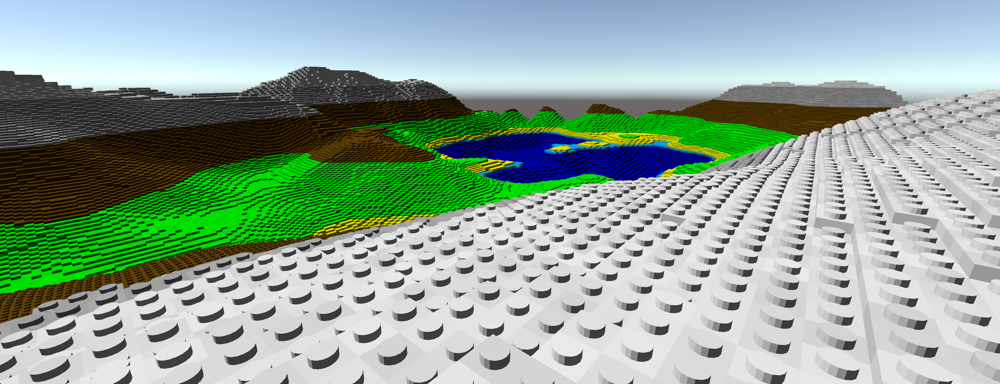

# Clotzbergh

## Status Quo

## TODOs

List of TODOs

Documentation:
- Write some documentation

Code:
- Apply and verify some coding guidelines and style
  - Casing for names of public fields

Game-play:
- Add colors to klotzes
- Klotz-Hoover
- Multiplayer: Update server about real position (often)

Deployment:
- How to bundle the game?

Learn:
- https://github.com/mxgmn/WaveFunctionCollapse
