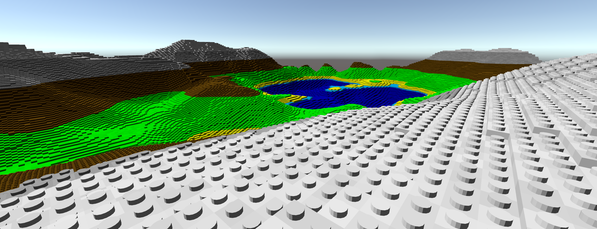

# Clotzbergh

## Status Quo

## Key Bindings

| Action | Button |
|--------|--------|
| Movement | W-A-S-D or arrow keys |
| Jump | Space-Bar |
| Run | Left Shift |
| Crouch | R |
| Selection Mode | Mouse Wheel |
| Toggle Studs | F11 |
| Toggle Debug Panel | F12 |

## TODOs

List of TODOs

Bugs:
- ~~Fix cutout (should just be a hole)~~

Documentation:
- ☐ Write some initial documentation

Code:
- ☐ Apply and verify some coding guidelines and style
  - ☐ Casing for names of public fields
- ☐ Rename `TakeKlotz` (command, ops and handlers) to something more general. Carry all world modification actions, not just taking a single klotz.

Game-play:
- ☑ Add colors to klotzes (2024-Nov-03)
- ☑ Add per klotz color variants (2024-Nov-12)
- ☑ Multiplayer (level 1) (2024-Nov-16)
  - ☑ Client: Update server about real position, often (2024-Nov-15)
  - ☑ Server: Add server status (2024-Nov-15)
  - ☑ Server: Add other players list (2024-Nov-16)
  - ☑ Client: Display other players (2024-Nov-16)
- Server-side features
  - ☑ Saving and loading of the world (2024-Dec-10)
  - ☐ Thread-safe world updates
- ☑ Non-primitive klotz types, modeled in Blender (2026-Aug-29)
  - ☑ Door and window frames, single slopes, stairs (2026-Aug-29)
  - ☑ ArtSource pipeline: build scripts, FBX export, auto-discovery via Resources (2026-Aug-29)
  - ☑ Per-face surface features (studs, holes, rough) resolved by material name (2026-Aug-28)
  - ☐ `HasHoles` has no representation - the shader decodes the flag but draws nothing
  - ☐ Missing `Slope45Double` (ridge cap), so the topmost roof row is left open
- ☑ Procedurally built houses (2026-Aug-31)
  - ☑ Walls from bricks in running bond, with interlocking corners (2026-Aug-30)
  - ☑ Roofs from real slope klotzes, plus gable walls (2026-Aug-30)
  - ☑ Ceilings, herringbone tile floors and stairs per story (2026-Aug-31)
  - ☐ Structures cannot span chunks, which caps a house at the chunk size
- ☑ Tile klotz types - flat, no studs on top (2026-Aug-31)
- ☑ Scale player character to real minifig proportions (2026-Aug-28)
- ☐ Player interaction with game (level 1)
  - ☑ Client-side prediction of world changes, so they show up without waiting for the server (2026-Aug-30)
    - ☑ Take sequence numbers, acknowledged by the server (2026-Aug-30)
    - ☑ Re-apply still-unconfirmed takes onto incoming chunk data (2026-Aug-30)
    - ☐ Chunk checksums exist but are unused - could let the server skip sending whole chunks
  - ☐ Inventory: a taken klotz should end up with the player
    - ☐ Needs a reply to the requesting client (success plus klotz type); do not predict the
      item itself, or it may have to be taken away again
  - ☑ Multi-klotz collection
    - ☑ Cutout for multi-klotz selection
  - ☐ Placing klotzes

Deployment:
- ☐ How to bundle the game?

Learn:
- https://github.com/mxgmn/WaveFunctionCollapse
